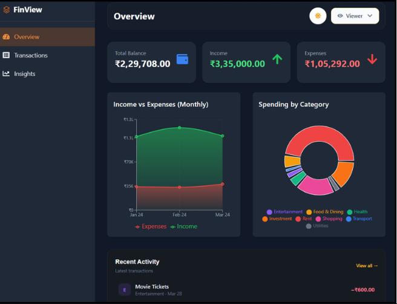
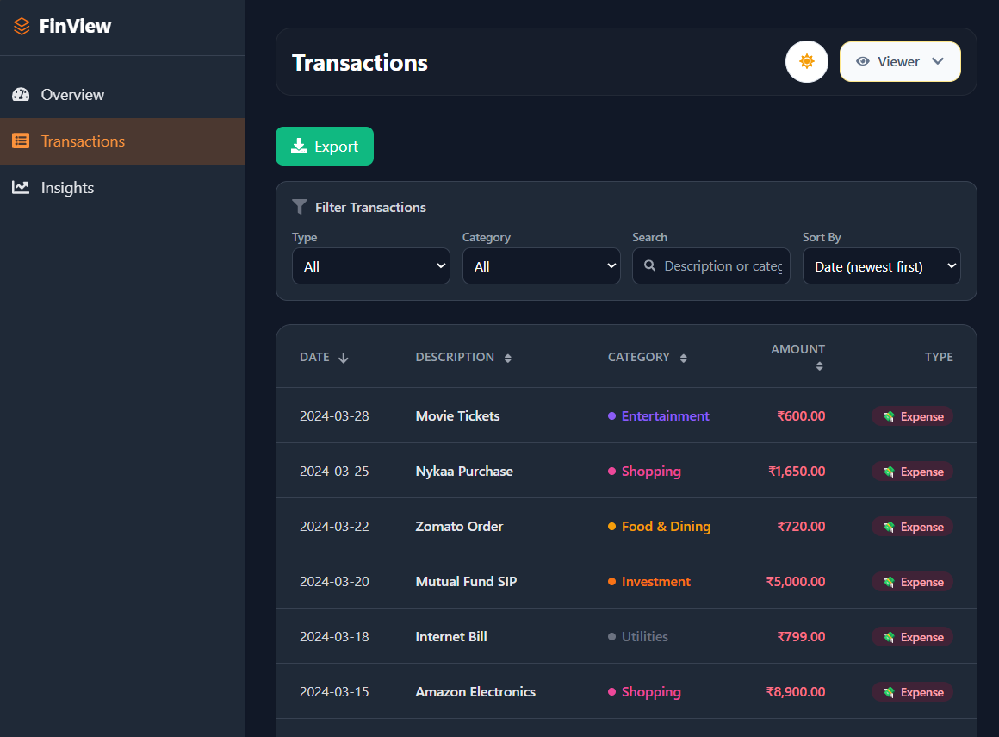
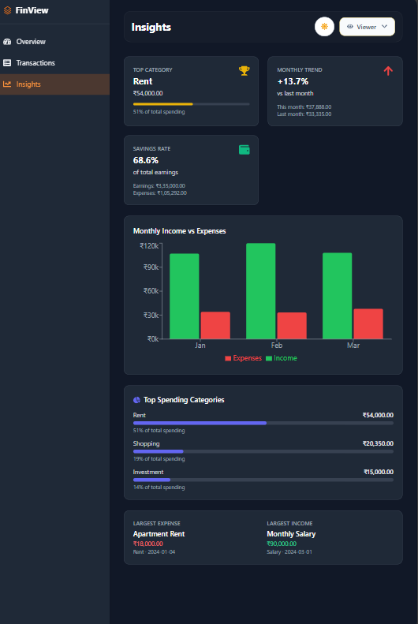

# FinView – Smart Finance Dashboard

A modern, responsive finance dashboard built with React, Tailwind CSS, and Recharts. Track income, expenses, and spending patterns with a clean UI, dark mode, role‑based access, and full data persistence.



## ✨ Features

### 📌 Core
- **Overview** – Summary cards (balance, income, expenses), interactive area chart (income vs expenses), doughnut chart (spending by category), and recent activity feed.
- **Transactions** – Full transaction list with filtering (type, category, search), sorting (date, amount, description), and **CSV/JSON export**.
- **Role‑Based UI** – Switch between **Viewer** (read‑only) and **Admin** (add, edit, delete transactions).
- **Insights** – Top spending category, monthly expense comparison, savings rate, top 3 categories (progress bars), largest expense/income, and monthly income/expenses bar chart.
- **State Management** – React Context + useReducer with localStorage persistence (transactions & role survive page refresh).
### 🎨 Enhancements
- **Dark Mode** – One‑click toggle, saved in localStorage.
- **Sidebar Navigation** – Collapsible hamburger menu (mobile‑friendly) to switch between Overview, Transactions, and Insights.
- **Custom Categories** – Admins can add custom categories on‑the‑fly by selecting “Other” in the add transaction form.
- **Responsive Design** – Works flawlessly on desktop, tablet, and mobile.
## 🛠️ Built With

 ⚛️ Framework | [React.js](https://reactjs.org/) + [Vite](https://vitejs.dev/) |
| 🎨 Styling | [Tailwind CSS](https://tailwindcss.com/) |
| 📈 Charts | [Recharts](https://recharts.org/) |
| 🗃️ State Management | [Zustand](https://zustand-demo.pmnd.rs/) |
| 🔤 Icons | [Lucide React](https://lucide.dev/) |

---

## 🚀 Getting Started

### Prerequisites
- Node.js (v16 or later)
- npm or yarn

### Installation

```bash
# 1️⃣ Clone the repository
git clone https://github.com/Tahreen-05/finance-dashboard.git
cd finance-dashboard

# 2️⃣ Install dependencies
npm install

# 3️⃣ Start the development server
npm run dev